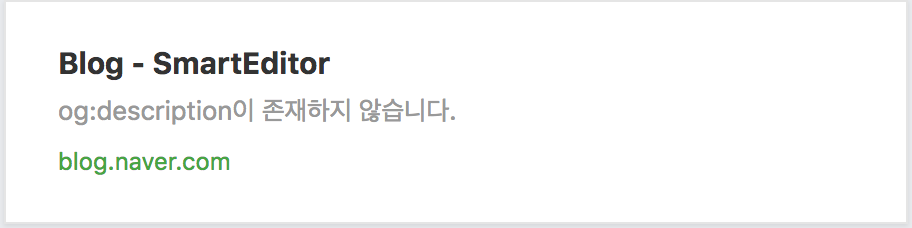

Chrome Extension : OG Tag Preview
=============
현재 브라우저 탭의 url 정보를 받아와 해당 페이지를 크롤링하여 오픈 그래프 태그(OG Tag) 목록을 보여줍니다. 
'링크 미리보기' 기능은 네이버 블로그에서 링크를 삽입할 때 나타나는 미리보기 모양을 참고하여 만들었으며, 페이스북, 트위터, 카카오톡 등과 같은 소셜 페이지의 공유 미리보기 화면을 한눈에 볼 수 있도록 할 계획입니다.
 

### 상세 설명
---------------

### 기능 설명 
---------------
og:title, og:description, og:image, og:url
1. og:title
>og:title 속성이 누락된 경우, title태그를 가져옵니다.

2. og:image
[네이버 블로그의 링크삽입을 참고]
>지정된 이미지 경로가 올바르지 않은 경우(상대경로) 올바른 url을 생성합니다.
>  
>이미지의 크기에 따른 미리보기 화면의 변화를 확인 할 수 있습니다.

 

### 추가 계획
----------------
- 페이스북, 트위터, 카카오톡 등과 같은 소셜 페이지의 공유 미리보기 화면
- og:title, og:description, og:image, og:url 외 다른 OG태그 포함 
- 웹 개발자를 위한 OG태그 자동 생성
